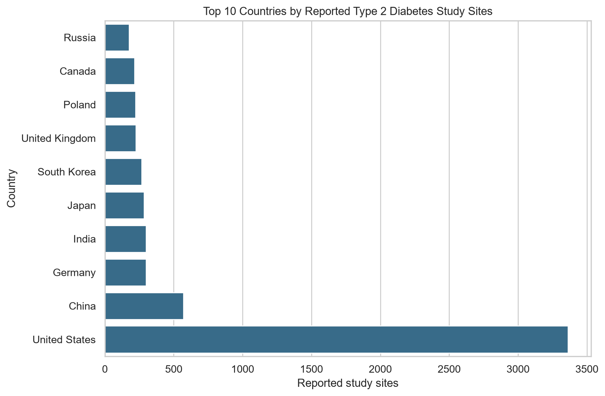
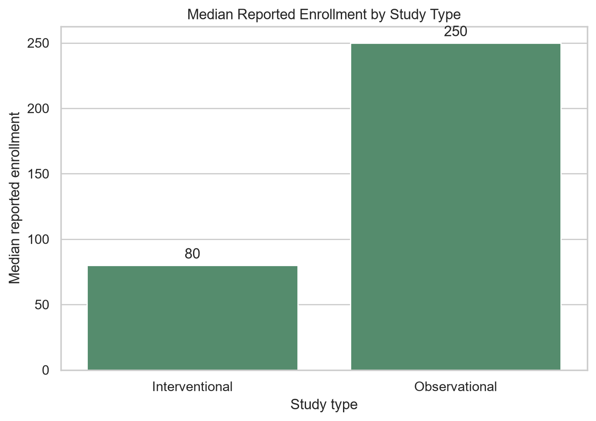

# TrialScope: Clinical Trial Representation Analysis

A reproducible Python and SQL analysis of representation patterns in Type 2
diabetes clinical-trial records from ClinicalTrials.gov.

## Project question

How do stated eligibility, trial size, study type, funding, sponsors, and
geographic scope vary across a downloaded sample of Type 2 diabetes clinical
trials?

## Why this project

Clinical trial metadata is often complex and incomplete. This project uses
public registry data to practise a complete data-analysis workflow:

- loading and auditing raw data;
- cleaning and documenting decisions;
- analysing data with Python, Pandas, NumPy, and SQL;
- interpreting findings without overstating what registry data can show;
- publishing a reproducible project structure with Git and GitHub.

## Dataset

- **Source:** [ClinicalTrials.gov](https://clinicaltrials.gov/)
- **Condition searched:** Type 2 Diabetes
- **Records analysed:** Top 1,000 downloaded search results
- **Raw format:** CSV
- **Unit of analysis:** Clinical-trial study records; a separate table is
  created for individual reported study sites.

The raw source CSV is intentionally not uploaded to this repository. See
[docs/data_source.md](docs/data_source.md) for data-source and handling details.

## Key findings

- 96.7% of records were open to all sexes in their stated eligibility criteria.
- 87.9% included older adults, while 5.6% included children.
- Median reported enrollment was 80 for interventional studies and 250 for
  observational studies.
- `OTHER` and `INDUSTRY` funder types accounted for 53.4% and 43.8% of records,
  respectively.
- The processed location table contains 7,968 reported sites across 84
  countries.
- 82.3% of studies were single-country, 7.4% were multi-country, and 10.3%
  had no reported location.

Read the complete, carefully qualified interpretation in
[docs/key_findings.md](docs/key_findings.md).

## Visualisations

### Reported study sites by country



### Typical enrollment by study type



## Repository structure

```text
├── data/
│   ├── processed/     # Cleaned analysis tables created by the notebook
│   └── raw/           # Local raw download; excluded from GitHub
├── docs/
│   ├── data_source.md
│   └── key_findings.md
├── notebooks/
│   ├── 01_python_warmup.ipynb
│   └── 02_load_raw_data.ipynb
├── sql/
│   └── analysis_queries.sql
├── requirements.txt
└── README.md
```

## How to reproduce

1. Download Type 2 diabetes study records as CSV from ClinicalTrials.gov.
2. Save the CSV inside `data/raw/`.
3. Create and activate a Python environment.
4. Install the packages listed in `requirements.txt`.
5. Run `notebooks/02_load_raw_data.ipynb` from top to bottom.

The notebook creates:

- `data/processed/trialscope_clean.csv`
- `data/processed/trialscope_locations_long.csv`

## Tools used

- Python
- Pandas
- NumPy
- DuckDB SQL
- Jupyter Notebook
- Git and GitHub

## Limitations

This is an analysis of a fixed download of the top 1,000 search results, not
the full ClinicalTrials.gov registry. The project describes registry metadata
and stated eligibility criteria, rather than actual participant demographics,
clinical effectiveness, or causal effects.